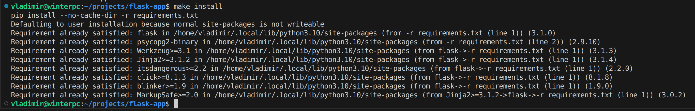
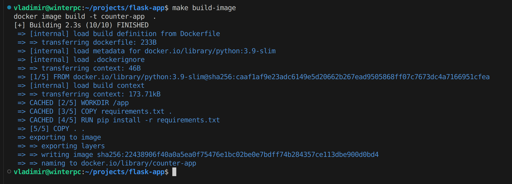
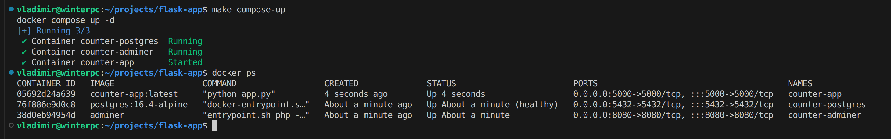
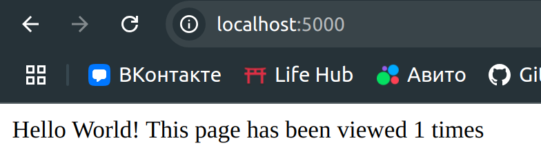
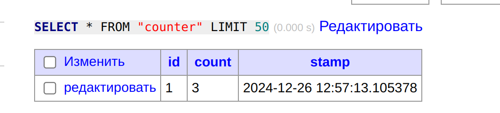

# Развёртывание

## Docker-развёртывание

### Pre-requisites

- Docker & Docker Compose
- make (Unix-builtin)
- python v3.x.x

### Шаги

- `make install` - устанавливаем зависимости
- `make build-image` - собираем образ
- `make compose-up` - поднимаем компоуз с контейнерами

# Результат

Устанавливаем зависимости

Собираем образ

Поднимаем компоуз

Стучимся в наше приложение

Смотрим результат в БД
